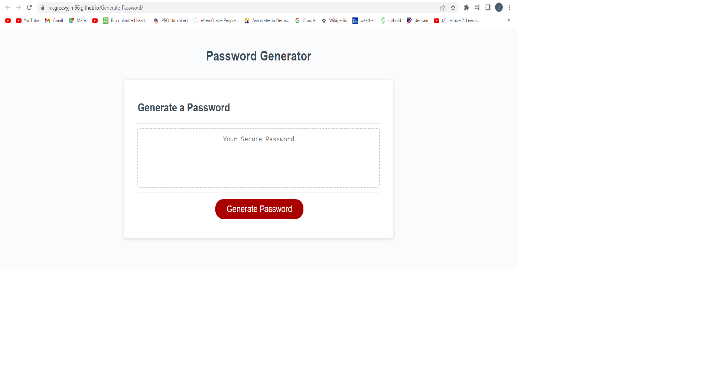

# Generate Password

## Description

 This project is an application that enables employees to generate random passwords based on criteria that they’ve selected. Two methods of prompting have been implemented, one that use regular built-in windows prompting
 and a second method tha that uses an HTML dialog and javascipt to interact with the user.

This app will run in the browser and will feature dynamically updated HTML and CSS powered by JavaScript. It will have a clean and polished, responsive user interface that adapts to multiple screen sizes.
 
 During this project I learned to importance of using window prompts and alerts  as well as defining and using javascipt functions to interact with the user, media queries to actviely adjust display to different screen sizes, as how make better use of CSS by consoldating redundent clasess.

## Usage

To use the Horiseon Marketng Solution website, please vist <https://mcgreevyjim66.github.io/Generate-Password/>

## Source

My repo, is located at <https://github.com/mcgreevyjim66/Generate-Password>.
There is source code located in the Horiseon-Refactor folder, as well as in the ./assets/images and ./assets/css folders.

## Mock-up

## Credits

Author: Jim McGreevy
Date:   7/18/2023

